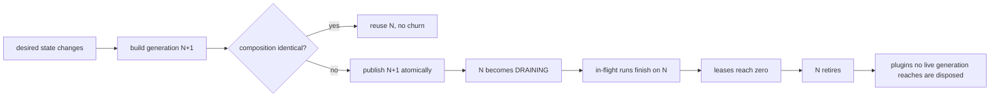

# Why immutable generations

Most agent frameworks assume the runtime is a constant: the model, the tools, the
database, and the policy are wired once at import time and never change. Real
applications are not like that. A tenant is onboarded, a model is retired, a tool is
revoked, a policy tightens, a secret rotates — while requests are in flight. This page
explains the mechanism Chassis uses to make that safe, and why the alternatives are
worse.

## The shape of the problem

Consider a support agent that answers requests through a database pool and a model.
At 12:00 you point it at a new model. Two things must both be true:

1. requests arriving after the switch use the new model;
2. requests already running finish against a composition that makes sense — including
   the database handle they were given, the policy that authorised their tool calls,
   and the secret provider they read from.

The second requirement is the one that gets forgotten. A request that reads the model
from a global, or that reaches for "whatever is current" in the middle of a tool call,
can end up half-old and half-new: two model providers in one run, a policy that denies
a call the run was told it could make, a database handle whose connection was closed
underneath it.

## What people do instead

**Global mutable singletons.** Reassignment is visible to every task at the next read.
No run can say which configuration it executed against, and a swap can land between
two lines of the same run.

**Hot-swapping the objects.** Mutating a provider in place is worse: in-flight runs
hold references to the same object, so their semantics change mid-run, and there is no
moment at which the change is atomic for everybody.

**Restart the process.** Correct, and often fine — but it drops every in-flight
request and every warm resource, and it makes plugin composition a startup-only
concern.

## What Chassis does

Composition changes are not mutations. They are a new **generation**: an immutable
snapshot of the capability providers, tool snapshot, hook snapshot, policy, secret
provider, and plugin instances, published atomically.



Four properties fall out of that:

- **A run is coherent.** It acquires one generation and keeps it. Everything it reads
  — model, database, policy, secrets, tools, hooks — comes from that one snapshot.
- **A swap is atomic.** Acquisition and publication are await-free
  read-and-increment sequences, so a run either sees the old complete generation or
  the new complete generation. Never a partially reconciled one.
- **Unload is not destruction.** Removing a plugin means "absent from the next
  generation". Its scope closes only when no live generation reaches it, so a run
  holding the old composition keeps working while the new one is already serving.
- **Cache keys stay honest.** Graph compilation depends only on build-time inputs;
  swapping a model reuses the compiled graph instead of rebuilding it.

## What it costs

One lease per run, and the discipline of never mutating a published generation.
In exchange, incidents become reproducible: every run carries the generation id and a
snapshot digest naming the plugins, capability versions, tool schema, and graph
definition it executed against. "Which model answered this request?" has an answer
that does not depend on when you asked.

The trade-off is deliberate, and it is visible in the API: configuration changes are
reconciled as *replacements*, not in-place reconfiguration. Mutating a live instance
cannot be made safe while older generations still hold it
([design.md](design.md)).

## See it

`examples/safe_provider_replacement.py` runs the exact scenario from the top of this
page and asserts it: a run starts on generation N, the provider is replaced, the run
finishes on N with its original provider, a new run uses N+1, and the old provider is
disposed only after the last run releases it.

```bash
uv run python examples/safe_provider_replacement.py
```

If you take one idea from this page, take the invariant:

> A plugin scope may be physically disposed only when no live runtime generation can
> reach it.

Everything else — leases, draining, reclamation, the diagnostics that show them — is
machinery for that sentence. [lifecycle.md](lifecycle.md) covers it in detail.
